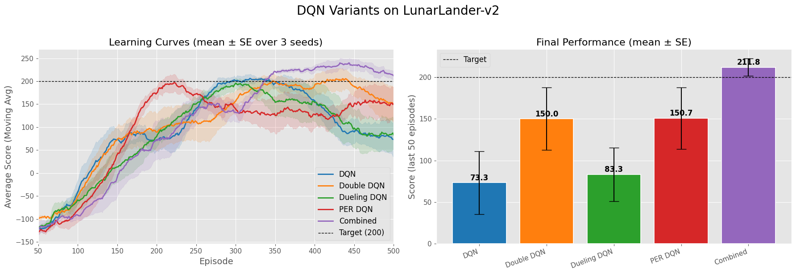

# DRL Homework 1 – Value-Based Methods

**Deep Reinforcement Learning (Spring 2026)**  
Yashar Zafari Haqqi


## Overview

This repository contains my solution for the first homework assignment of the DRL course. The assignment covers:

- **TD Learning with Linear Function Approximation** (theoretical derivations in `RL_HW1.pdf`)
- **Bellman Operators & Residuals** (theoretical proofs)
- **Half‑Rainbow DQN** on `LunarLander-v2` (practical implementation)

The main deliverable is a Jupyter notebook (`404210253_YasharZafariHaqqi.ipynb`) that implements and compares five agents:

| Agent            | Techniques                                      |
|------------------|-------------------------------------------------|
| DQN              | baseline deep Q‑network                         |
| Double DQN       | decoupled action selection & evaluation         |
| Dueling DQN      | separate value/advantage streams                |
| PER DQN          | prioritised experience replay                   |
| Combined         | Double + Dueling + PER (Half‑Rainbow)           |

---

## File Structure

```
HW1/
├── 404210253_YasharZafariHaqqi.ipynb   # Main notebook with training code
├── RL_HW1.pdf                           # Assignment problems (questions only)
├── image.png                            # Training curves (all agents)
├── halfrainbow_v3.mp4                   # Video of the trained Half‑Rainbow agent
├── weights_DQN.pth                      # Saved weights for DQN
├── weights_Double_DQN.pth               # Saved weights for Double DQN
├── weights_Dueling_DQN.pth              # Saved weights for Dueling DQN
├── weights_PER_DQN.pth                  # Saved weights for PER DQN
├── weights_Combined.pth                 # Saved weights for Half‑Rainbow
└── README.md                            # This file
```

---

## How to Run

1. **Install dependencies**  
   The notebook requires `torch`, `gymnasium`, `numpy`, `matplotlib`, and `tqdm`.  
   You can install them with:
   ```bash
   pip install torch gymnasium numpy matplotlib tqdm
   ```

2. **Launch the notebook**  
   Open `404210253_YasharZafariHaqqi.ipynb` in Jupyter or VS Code and execute the cells sequentially.  
   Training all agents from scratch may take several hours. The provided weight files allow you to skip training and directly evaluate the agents.

3. **Loading pre‑trained weights**  
   In the notebook, set the `load_weights` flag (or similar variable) to `True` and specify the corresponding `.pth` file.  
   Example for the Combined agent:
   ```python
   agent.load_state_dict(torch.load('weights_Combined.pth'))
   ```

---

## Results

### Training Curves



The learning curves show the average score (moving average) over 500 episodes, with ±1 standard error over 3 seeds.

### Final Performance (mean ± SE over last 100 episodes)

| Agent         | Score (mean ± SE) |
|---------------|-------------------|
| DQN           |  73.3 ± 37.5      |
| Double DQN    | 150.0 ± 37.5      |
| Dueling DQN   |  83.3 ± 32.1      |
| PER DQN       | 150.7 ± 37.0      |
| **Combined**  | **211.8 ± 10.5**  |

The Half‑Rainbow (Combined) agent surpasses the LunarLander‑v2 solve threshold of 200 and achieves the lowest variance, demonstrating that the three improvements are complementary.

### Video

Below is a test run of the trained Half‑Rainbow agent:

<video src="halfrainbow_v3.mp4" width="600" controls></video>

*(If the video doesn't render inline, open the file directly.)*

---

## Notes

- The theoretical solutions to the written problems are not included in this repository; they are in a separate PDF solution file (submitted separately).
- Hyperparameters for all agents are detailed in the notebook.
- The weights were saved after 500 episodes of training on a single machine (CPU/GPU). Make sure the environment version matches (`LunarLander-v2`, Box2D).

---

## References

- Mnih et al. – Human‑level control through deep reinforcement learning (2015)  
- van Hasselt et al. – Deep Reinforcement Learning with Double Q‑Learning (2016)  
- Wang et al. – Dueling Network Architectures for Deep RL (2016)  
- Schaul et al. – Prioritized Experience Replay (2016)
